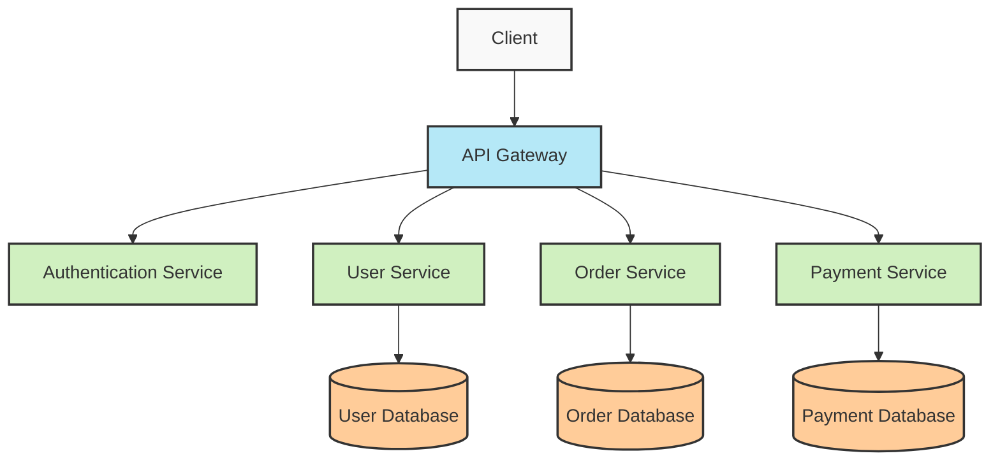

# 🌟 Chào mừng đến với Microservice Architecture! 🌟

<div align="center">
  
  
  
  *"A great building must begin with the immeasurable, must go through measurable means when it is being designed, and in the end must be unmeasured."* - Louis Kahn

</div>

## 📋 Giới thiệu

Microservice Architecture là một phương pháp phát triển phần mềm trong đó ứng dụng được cấu trúc như một tập hợp các dịch vụ nhỏ, độc lập:

- ✅ **Độc lập về triển khai**: Mỗi dịch vụ có thể được triển khai riêng biệt
- ✅ **Độc lập về công nghệ**: Mỗi dịch vụ có thể sử dụng công nghệ khác nhau
- ✅ **Mô hình dữ liệu riêng biệt**: Mỗi dịch vụ quản lý dữ liệu của riêng mình

## 🏗️ Các thành phần chính

| Thành phần | Mô tả | Công nghệ phổ biến |
|------------|-------|-------------------|
| **API Gateway** | Điểm vào duy nhất cho tất cả client | Spring Cloud Gateway, Netflix Zuul |
| **Service Discovery** | Tìm kiếm và đăng ký dịch vụ | Eureka, Consul, ZooKeeper |
| **Config Server** | Quản lý cấu hình tập trung | Spring Cloud Config |
| **Circuit Breaker** | Xử lý lỗi và phục hồi | Hystrix, Resilience4j |
| **Event Bus** | Giao tiếp giữa các dịch vụ | Kafka, RabbitMQ |

## 🌐 Kiến trúc tổng quan



## 💡 Ưu điểm và nhược điểm

### Ưu điểm ✨

> "Microservices are about decoupling. The goal is to find functional seams in the business domain and build small, cohesive services around those." - Sam Newman

- 🚀 **Khả năng mở rộng**: Dễ dàng mở rộng từng dịch vụ riêng biệt
- 🔄 **Triển khai liên tục**: CI/CD dễ dàng hơn với các dịch vụ nhỏ
- 🛠️ **Đa dạng công nghệ**: Sử dụng công nghệ phù hợp cho từng dịch vụ
- 🧩 **Cô lập lỗi**: Lỗi ở một dịch vụ không ảnh hưởng đến toàn hệ thống

### Nhược điểm ⚠️

- 🔄 **Phức tạp hơn**: Quản lý nhiều dịch vụ độc lập
- 🌐 **Giao tiếp mạng**: Độ trễ khi giao tiếp giữa các dịch vụ
- 🧪 **Kiểm thử khó khăn hơn**: Testing end-to-end phức tạp
- 📊 **Giám sát**: Cần giám sát nhiều thành phần

## 🚀 Bắt đầu với Spring Boot Microservices

```java
@SpringBootApplication
public class UserServiceApplication {
    public static void main(String[] args) {
        SpringApplication.run(UserServiceApplication.class, args);
    }
}
```

## 📝 Tài liệu tham khảo

- [Martin Fowler - Microservices](https://martinfowler.com/articles/microservices.html)
- [Sam Newman - Building Microservices](https://samnewman.io/books/building_microservices/)
- [Spring Cloud](https://spring.io/projects/spring-cloud)
- [Microservices.io](https://microservices.io/)

---

<div align="center">
  <h3>❤️ Happy Coding ❤️</h3>
  <p><em>Created with 💻 by Cascade AI - 2025</em></p>
</div>
